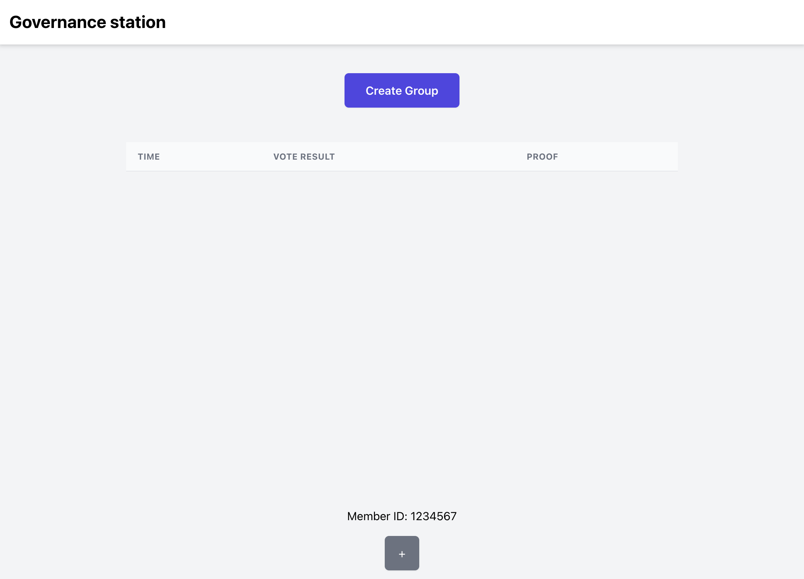
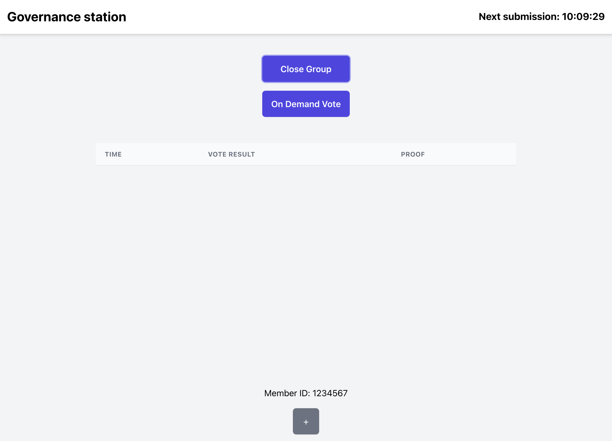
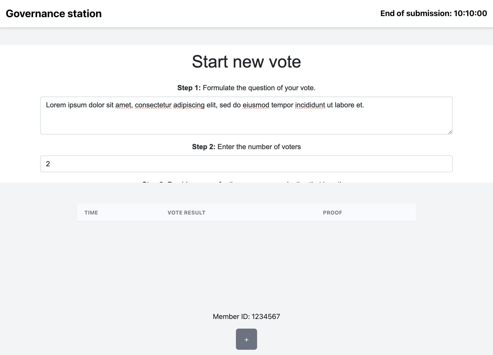
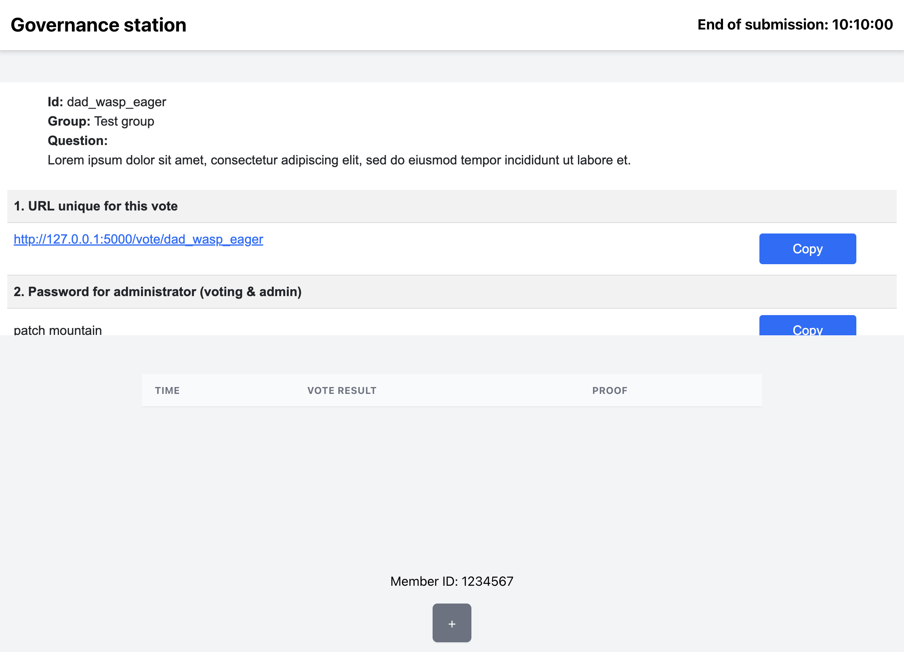
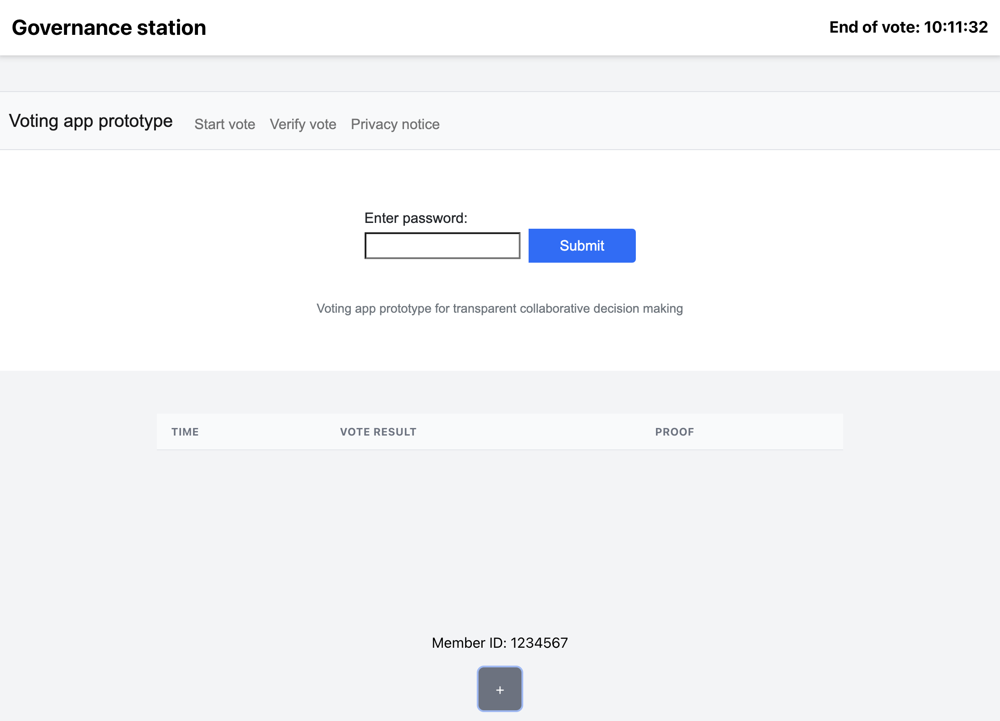
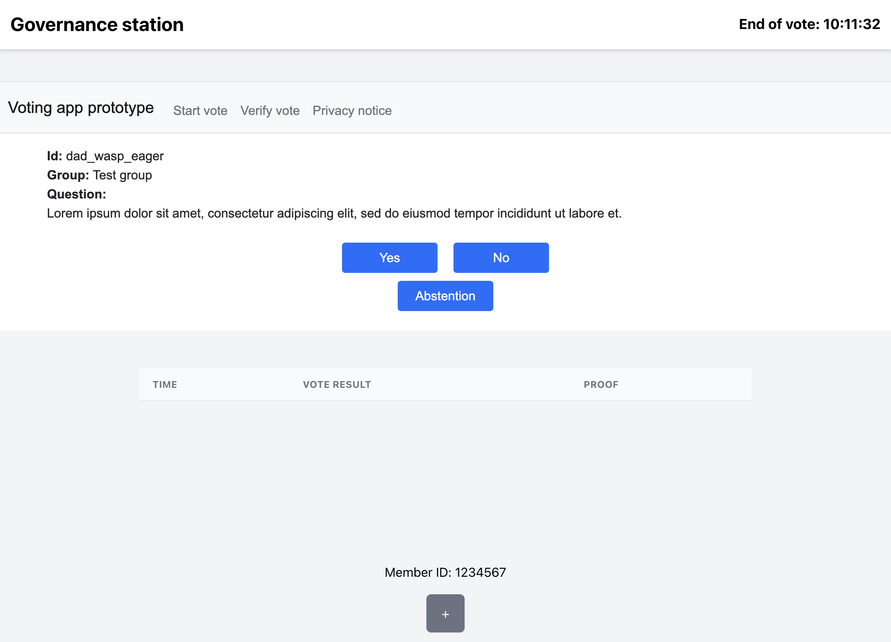
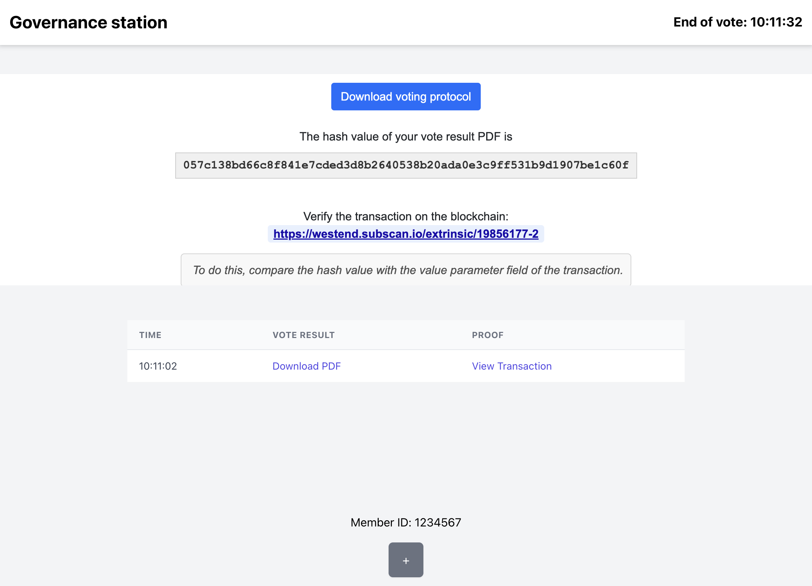
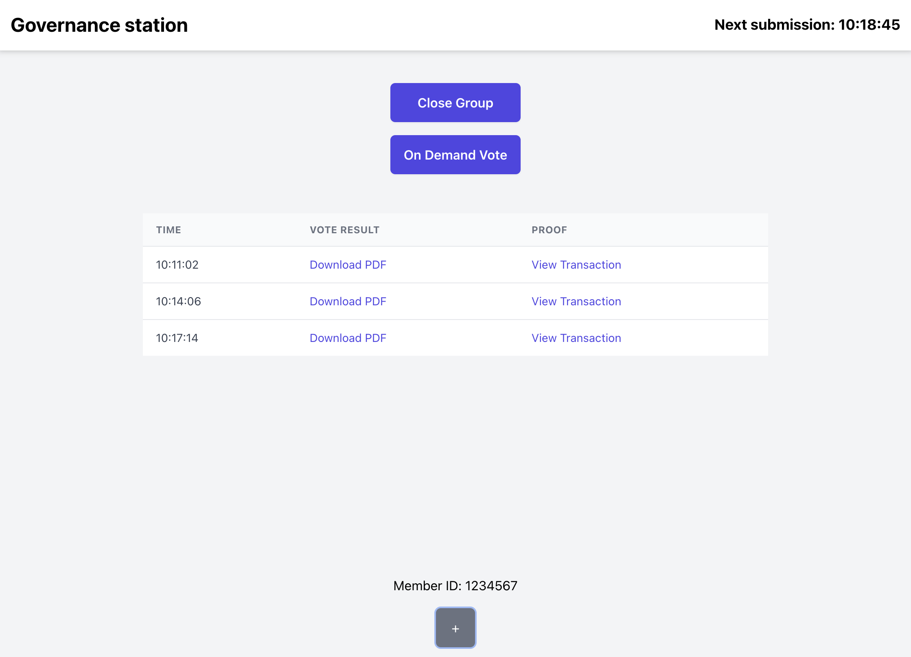

# Governance Station

*A convenient platform for traditional groups to conduct recurring and on-demand digital votes.*

## Lack of secure and verifiable digital voting for traditional groups

Groups like works councils in companies, political parties (internal voting), or property owners in real estate entities face challenges in conducting secure and verifiable digital votes. These groups require the capability to conduct either recurring (for instance, monthly) or on-demand voting. The votes are most of the time significant enough to necessitate a secure voting tool capable of digitally verifying and persistently storing the outcomes, ensuring that the history of voting results is verifiably maintained over time.

Currently, many of these groups rely on analog methods due to the lack of "easy to use" digital tools that offer sufficient result verification. If digital tools are used, vote management and result tracking often become fragmented (e.g. Whatsapp polls), treating each vote as an isolated event rather than part of an ongoing persistent governance process.

## A web2 voting platform with just enough web3 to create a verifiable history

An easy-to-use, modular and mostly automated governance platform is needed that leverages the convenience and speed of Web2, while incorporating just enough of Web3 to allow digital verification of governance results over time.

## Governance Station offers a modular voting platform

Governance Station automates (for now) voting and creates a digital verification history by employing Moonbeam smart contracts and Voting App. Smart contracts use block time to define timing windows for voting proposals and voting. Voting App uses Westend and will use Polkadot to store and retrieve proof of vote results. 

We started developing Voting App ("stateless" voting app using Flask, Node.js, light client, Subscan API) already in 2023 and the repo is not yet public. Therefore only Governance Station but not Voting App is part of this hackathon entry. We would be happy though to show the code in a call.

Schema how both apps fit together: https://docs.google.com/presentation/d/1-yV-XbbBpqaD4r5VlJq7Ksai0DLDJFpS4CUJ1Q7cXfc/edit?usp=sharing

### Architecture

Governance Station utilizes React for the frontend, ethers.js for Ethereum blockchain interactions, and Solidity for smart contract development. This is meant to be deployed to Moonbeam in the future.

#### Client-Side Application (React)

- Utilizes React for dynamic user interface management, including state management (useState, useEffect) for controlling web view displays and interaction with Ethereum smart contracts.
- Incorporates ethers.js for Ethereum blockchain interactions, enabling contract interactions via Contract and JsonRpcProvider components.
- Establishes a connection to Ethereum networks (local or Moonbeam) using environmental configurations for contract address, RPC URLs, and private keys.
- loads Voting App to perform vote proposal / submission and voting in iframe. In the future it will also integrate the verification route. Voting app is a Flask application utilizing Node.js (light client, Subscan API).

#### Smart contract (EVM, Solidity)

- Manages voting phases (idle, setup open/close, vote open/close) and web view states through smart contract functions (createGroup, closeGroup, checkAndUpdateExecution) and events (DisplayWebView, CloseWebView).
- Utilizes Hardhat for smart contract development, with configurations that specify compiler versions and network settings for both local development and future deployment on Moonbeam.

### Next steps (beyond this hackathon)

- Database integration, member authentication, and user roles.
- Admin and member user flows for proposals and votes.
- Secure handling of one-time passwords from the Voting App.
- Implementation of on-demand votes that do not interfere with recurring votes.
- Dynamic time windows set by admin for recurring and on-demand votes, including recurrence, proposal window, and voting window.
- Transition from using the Voting App via iframe to API integration.
- Enhancement of group creation logic, including a smart contract to create/deactivate contracts for each group.
- Enhancing representation of vote results (table > calendar / time flow, ...)
- Visualize complete proof chain of vote result (pdf > hash > remark value / tx timestamp)
- Addition of other governance modules, such as member profiles, discussions, treasury, and more.

## User flow

Demo video: https://www.loom.com/share/4b6798938ca444c9bd23c0c325c9f1d5?sid=2abbd290-6763-4e1b-84aa-5d8272ee0576

### Start screen

User loads the react app and then can create a group which will be an admin feature in the future. Below the button you see current vote results (empty). On the bottom you see the mocked user id. Below that is a + button to manually push the local blockchain block by block (30 seconds steps). This is only for testing (button will be removed) and will be automatic in the future (rythm of the blockchain block time).

### Create group

User clicks on create group and the app calls the smart contract to "activate" it. This call changes current phase from "idle" to "Vote submission window to open" and the next execution time (for the window to open) is set to block time + 1 minute. This means that the voting cycle (waiting, voting proposal time window, waiting, voting time window) started. In production this waiting windows can be set by admin and will be more in the range of days, weeks or months. Now for testing everything is in seconds and minutes.

When the contract current phase is not in idle (active group) the app polls the contract every couple of seconds to compare current time with execution time. This also will be less frequent in the productive version.

On the top right you see the time when the submission window (submit a voting proposal) will open. This is the block time + 1 minute retrieved from the contract by the app. 

The first button "Close group" can be clicked to close the group. This calls the smart contract to set the current phase to idle and the voting cycle / polling stops.

Below you see the "On Demand Vote" button. This is not yet implemented. It will start a voting cycle (voting proposal window, waiting, voting window) right away without interfering with the set recurring voting cycle.

### Voting proposal

When current time is execution time (smart contract) in phase "proposal / setup to open" the react app loads Voting App vote proposal screen in an iframe. On the screen you can define your vote proposal:

- Voting question
- Number of voters > this will be handled by Governance Station in future
- Name of voting group > this will be handled by Governance Station in future
- Define voting options (binary) > this will be enhanced to more options in the future
- Duration of the vote > this will be handled by Governance Station in future

### Voting details

After clicking on "Create vote" Voting App creates and shows a unique id (3 random english words) for the vote together with other vote details and the one time passwords for each voter / member. This will be handled by Governance Station in the future so that if a member proposes a vote, she will only see her one time password. Each members sees a new vote scheduled and a one time password to vote in Governance Station.

### Voting

After the vote propsal window closed automatically governed by block time (smart contract) and the waiting period is over, the vote window opens. Members has to provide the one time password for this vote.

After submitting the password, member can vote.

After voting, member sees the vote result. Voting App creates a voting protocol / vote result PDF and stores the hash of this pdf as value in a Westend remark transaction for later proof. Governance Station stores (right now pdf link to Voting App, in future version: decentralized storage like IPFS) the vote result PDF and Subscan link to the proof transaction together with the vote time in a table.

- Voting protocol: This is a pdf that summarizes the outcome of the vote. Example vote protocol: [Example vote protocol](assets/vote_dad_wasp_eager_240307.pdf)
- SHA256 Hash of voting protocol PDF. Example: 057c138bd66c8f841e7cded3d8b2640538b20ada0e3c9ff531b9d1907belc60f
- Subscan link to Westend remark transaction containing the pdf hash. Example tx: https://westend.subscan.io/extrinsic/19856177-2

### Voting cycle and history

This cycle (wait for proposal submission window to open, proposal submission window, wait for voting window to open, voting window) repeats and Governance App shows a history of votes in the table.

## Using the code

- Clone the repo
- Create .env file in root/client folder
- In root/contract start the local blockchain (hardhat): `npx hardhat node`
- Choose an account private key from the list of test accounts and insert in .env: `REACT_APP_TEST_PRIVATE_KEY=TEST_PRIVATE_KEY`
- In root/contract: `npx hardhat run scripts/deployTimedVoting.js --network localhost`
- Insert the contract address from deployment in .env: `REACT_APP_CONTRACT_ADDRESS=DEPLOYED_CONTRACT_ADDRESS`
- Insert local rpc url to .env: `REACT_APP_LOCAL_RPC_URL=LOCAL_RPC_URL`
- in root/client: `npm start`

(!) Because Governance Station is an extension of Voting App, which is not public (yet), the iframe will not show Voting App but the process of Governance Station is still functional and can be tested.